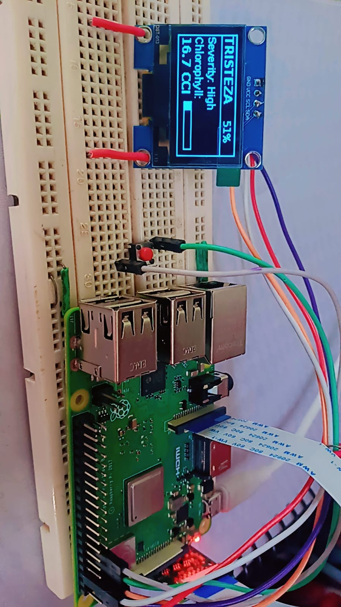

# 🌿 Citrus Disease Detector — Offline AI on Raspberry Pi



An offline, standalone AI-powered device that detects citrus leaf diseases, estimates chlorophyll content, and assesses severity — all running locally on a Raspberry Pi with **no internet, cloud, or server dependency**.

## 📋 Overview

Point the camera at a citrus leaf, press a button, and get instant results displayed on an OLED screen:
- **Disease classification**: Healthy, Greening, or Tristeza
- **Severity level**: Low, Medium, or High
- **Chlorophyll content**: Estimated CCI (Chlorophyll Content Index) value

The entire pipeline — image capture, AI inference, and result display — runs entirely on-device, making it deployable in the field where internet connectivity isn't available.

## 🎯 Features

- 📸 **One-button operation** — press to capture and analyze
- 🧠 **On-device AI inference** using TensorFlow Lite (no cloud API calls)
- 🖥️ **OLED display** showing live status and results
- 🔌 **Fully offline** — verified working with Wi-Fi disabled
- ⚡ **Auto-start on boot** via systemd service — no laptop needed for normal use
- 🎨 **Custom colour-feature extraction** (RGB, HSV, LAB, vegetation indices) matching the exact training pipeline

## 🛠️ Hardware Used

| Component | Details |
|---|---|
| Raspberry Pi 3 Model B+ | Main processing unit |
| Raspberry Pi Camera Module (ov5647) | Image capture |
| 1.3" OLED Display (SH1106, I2C) | Result display |
| Push Button | Capture trigger |
| MicroSD Card (8GB+) | OS and storage |

## 🧠 Model Details

- **Architecture**: Multi-output CNN with MobileNetV2 backbone
- **Inputs**: 224×224×3 RGB image + 14 hand-engineered colour features
- **Outputs**: Disease classification (3 classes), severity classification (3 levels), chlorophyll regression
- **Format**: TensorFlow Lite (`.tflite`) for efficient on-device inference
- **Runtime**: `ai_edge_litert` (Google's actively-maintained TFLite interpreter)

> Note: The trained model file (`model.tflite`) is not included in this repository. Please contact the repository owner for access.

## 📦 Software Stack

- Raspberry Pi OS (Bookworm, 64-bit Lite)
- Python 3.11
- TensorFlow Lite (via `ai_edge_litert`)
- OpenCV for image preprocessing
- `luma.oled` for display rendering
- `picamera2` for camera control
- `RPi.GPIO` for button input

## 🚀 Setup

### 1. Install dependencies
```bash
sudo apt update
sudo apt install -y python3-picamera2 i2c-tools libjpeg-dev zlib1g-dev libfreetype6-dev
pip3 install -r requirements.txt --break-system-packages
```

### 2. Enable I2C (for OLED)
```bash
sudo raspi-config
# Interface Options → I2C → Enable
```

### 3. Wire the hardware
| Component | Pi GPIO Pin |
|---|---|
| OLED VCC | 3.3V (Pin 1) |
| OLED GND | GND (Pin 6) |
| OLED SDA | GPIO2 (Pin 3) |
| OLED SCL | GPIO3 (Pin 5) |
| Button (leg 1) | GPIO17 (Pin 11) |
| Button (leg 2) | GND (Pin 9) |

### 4. Place model files
Copy `model.tflite`, `model_metadata.json`, and `scaler_params.json` into the same directory as `main.py`.

### 5. Run
```bash
python3 main.py
```
Press the button to capture and analyze a leaf. To test with a saved image instead of the camera:
```bash
python3 main.py /path/to/image.jpg
```

### 6. (Optional) Run automatically on boot
```bash
sudo cp systemd/leafscanner.service /etc/systemd/system/
sudo systemctl daemon-reload
sudo systemctl enable leafscanner.service
sudo systemctl start leafscanner.service
```

## 🔍 How It Works

1. **Capture** — Pi Camera captures a leaf image on button press
2. **Preprocess** — Image resized to 224×224, normalized for the model
3. **Colour features** — 14 features computed (RGB/HSV/LAB means, vegetation indices like ExG, VARI, GLI)
4. **Scaling** — Features scaled using the exact MinMaxScaler parameters from training
5. **Inference** — TFLite model runs on-device, producing three outputs
6. **Display** — Results shown on OLED and printed to console

## 🚧 Challenges Overcome

- Migrated from a Raspberry Pi Zero W (armv6l) to a Pi 3 B+ after discovering no modern TFLite runtime supports that architecture
- Diagnosed and replaced a faulty camera ribbon cable through systematic I2C-level debugging
- Resolved TensorFlow Lite operator version incompatibilities by switching to `ai_edge_litert`
- Reverse-engineered and precisely matched a multi-input model's exact preprocessing pipeline for accurate offline inference

## 🎥 Demo

[Watch the demo video](docs/demo-video.mp4)

## 📄 License

This project is for educational purposes. The trained AI model is proprietary to the project mentor and not included in this repository.

## 🙏 Acknowledgments

Special thanks to my mentor for providing the trained model and technical guidance throughout this project.